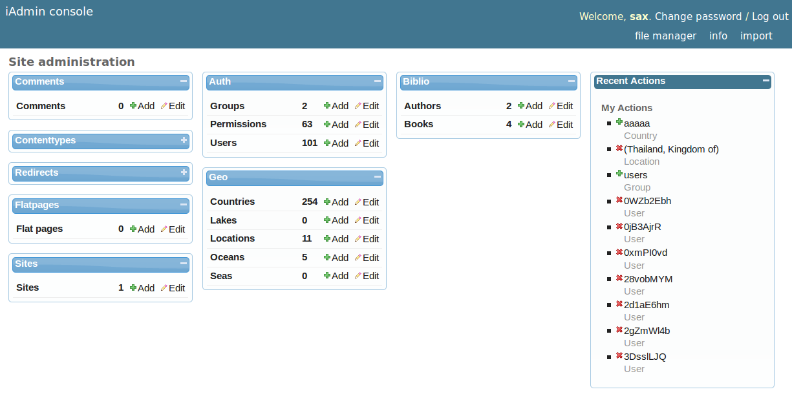
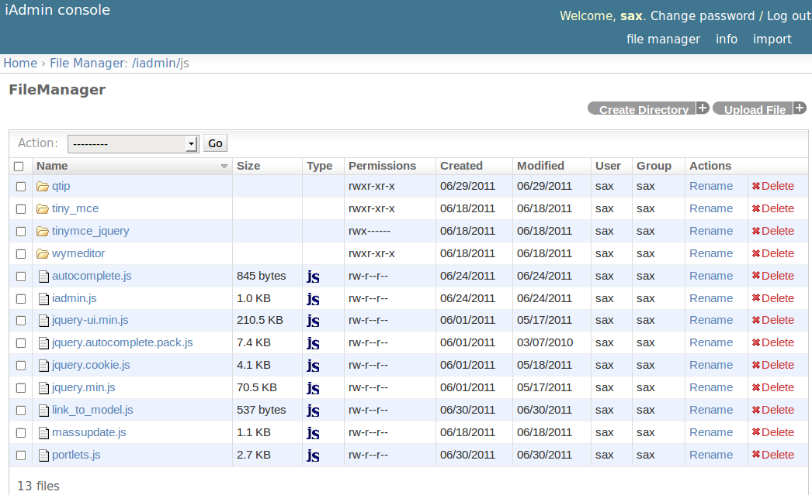

.. _tutorial:

=============================
Getting Started with iAdmin
=============================

This tutorial assumes that you have a basic understanding of Django.
We will only explain the portions of the code that are iAdmin-specific in any kind of depth.

.. _tutorial-home-page:

Home Page
=========

As installed iAdmin replace the standard home page with a 'portlets like' version.
The default template use a 5 columns layout, you can move the 'portlets' turu the columns and/or collapse them.
The layout is saved into a cookie to allow it to be restored.

    

iAdmin is able to shows the number of rows present in each table, the home page is cached and the cache is
invalidated each time a model is added/deleted using django :func:`django.db.models.signals.post_save` and
:func:`django.db.models.signals.post_delete` (see :mod:`django.db.models.signals`).
If you want enable this feature, you should set :doc:IADMIN_CONFIG as following::

    IADMIN_CONFIG = { 'count_rows': True,}

    CACHES = {
        'default': {
            'BACKEND': 'django.core.cache.backends.locmem.LocMemCache',
            'LOCATION': 'unique-snowflake'
        }
    }

The :setting:`CACHES` configuration is only an example, please refer to Django Cache System for further infos.

Changelist
==========

.. image:: _static/changelist_view.*

.. _tutorial-cell-filter:

Enabling cell filter menu
-------------------------

To enable the cell filter menu you need to set :attr:`~iadmin.options.IModelAdmin.cell_filter` ::

    class MyModelAdmin(iadmin.IModelAdmin):
        cell_filter = ('Region', 'Continent')

This will enable the cell filter menu for ``Region`` and  ``Continent`` fields

.. image:: _static/column_filter.*

by default only ``Equals to`` and ``Not equals to`` filters are enabled, but also ``Greater than``, ``Less than``,
``Greater or equals than`` and ``Less or equals than`` are available. To enable them, create an attribute named ``cell_filter_operators``
attribute for the selected column. You can that in multiple ways.

If the column is a :class:`django.db.models.Field` instance::

    class MyModel(models.model):
        myfield = IntegerField(...)
        myfield.cell_filter_operators = ('lt', 'gt', 'lte', 'gte', 'exact', 'not')

or::

    class MyModelAdmin(iadmin.IModelAdmin):
        def __init__(self, model, admin_site):
            super(MyModelAdmin, self).__init__(model, admin_site)
            model._meta.get_field_by_name('myfield')[0].cell_filter_operators = ('lt', 'gt', 'lte', 'gte', 'exact', 'not')

.. note:: Even if second way is more verbose, I suggest that one because decouples more the model layer from the (i)admin application

If the column is a callable of the ModelAdmin that represents a certain database field::

    class LocationAdmin(admin.ModelAdmin):
        list_display = ('name', 'country', 'country_continent')
        cell_filter = ('country', 'country_continent', )

        def country_continent(self, h):
            return h.country.continent
        country_continent.admin_order_field = 'country__continent'
        country_continent.cell_filter_operators = ('lt', 'gt', 'exact', 'not')

.. note:: iAdmin use the ``admin_order_field`` as filtering field

Once that a queryset is filtered you can apply more filter using cell menus or "right side" filters, both of them will
be in and until you don't select twice the same column, in that case the last selection will be used.

.. note:: an icon will be showed on the header of the filtered column(s)

.. _list_display_rel_links:

Direct link from list to edit form
----------------------------------

If you have a column that represent a :ref:`django.db.models.ForeignKey`,  you can create a link from
each cell in the changelist to the related edit page listing the column name into ``list_display_rel_links`` attribute of IModelAdmin::

    class LocationAdmin(admin.ModelAdmin):
        list_display = ('name', 'country', 'country_continent')
        list_display_rel_links = ('country', )

.. note:: The fields listed into ``list_display_rel_links`` MUST be present also in ``list_display``

Extra actions
-------------

.. toctree::
    :maxdepth: 2

    actions

FileManager
===========

FileManager is a simple files and directories management application that allow you to:
  * browse files/directories on your server
  * upload files.
  * delete/rename files and or directories.
  * create .tar archives
  
Configuring FileManager
-----------------------
First of all, you need to set :ref:`IADMIN_FM_ROOT` in your settings, the absolute path of the base directory,
by default this value is equal to :setting:`MEDIA_ROOT`.

To limit the visibility of files and directory you can use the :ref:`IADMIN_jFM_CONFIG` do set a callback that handle the file list::

    def filemanager_file_visibility_manager(fso):
        return not fso.hidden
    IADMIN_FM_CONFIG = { 'show': filemanager_file_visibility_manager }

the callback is passed a :ref:`iadmin.

Info Panel
==========

Import from CSV
===============

Configuring

